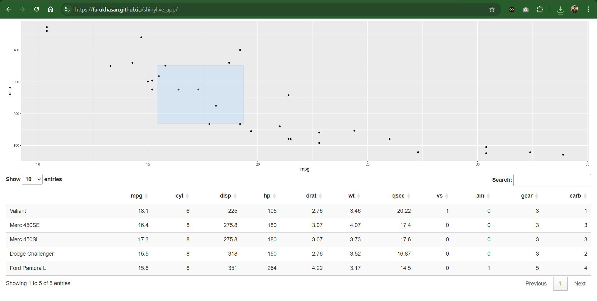

# Share Your Shiny App with Shinylive on GitHub Pages

This guide explains how to deploy a Shiny app that runs directly in a browser without a server, using Shinylive and GitHub Pages. The example app below, built with the `mtcars` dataset, features an interactive scatter plot and data table. See what it looks like and learn how it works behind the scenes.



You will discover how to host a Shiny app on GitHub Pages using Shinylive, making it accessible directly from any browser without server costs.

## Why Shinylive?
Traditional Shiny apps rely on servers like Posit Connect to process interactions. Shinylive eliminates the need for a server by compiling your app into a static webpage that runs entirely in the user’s browser. This approach is cost-free and easy to share but depends on the user’s device for performance, making it ideal for lightweight apps.

### Behind the Scenes
Shinylive leverages WebAssembly to convert your R code into browser-compatible files (HTML, CSS, JavaScript), stored in a `docs` folder. When a user visits your app’s URL, their browser downloads these files and runs the app locally. GitHub Pages serves the static files, while the browser handles all interactivity, like updating plots or tables, without server communication. This serverless setup simplifies deployment but limits apps to the computational power of the user’s device.

## What You Need
- A GitHub account ([sign up]) (https://docs.github.com/en/get-started/signing-up-for-github) if you don’t have one).
- R and RStudio installed.
- Two R packages: `shinylive` and `httpuv`. Install them in your R console:
  
  ```R
  install.packages("shinylive")
  install.packages("httpuv")
  ```
  Load them with:
  ```R
  library(shinylive)
  library(httpuv)
  ```
- (Optional) GitHub Desktop for easier repository management ([set it up](https://docs.github.com/en/desktop/installing-and-configuring-github-desktop)). Command-line Git is fine too.

## Create Your App
Set up a new RStudio project:
- In RStudio, go to *File > New Project > New Directory > Shiny Application*.
- Name it (e.g., `mtcars_demo`) and select a save location (like Desktop).
- Click *Create Project* to generate an `app.R` file.

For this guide, use a sample app that visualizes `mtcars`. Replace the default `app.R` code with:

```R
library(shiny)
library(ggplot2)
library(DT)

ui <- fluidPage(
  plotOutput("plot", brush = "plot_brush"),
  DTOutput("table")
)

server <- function(input, output) {
  output$plot <- renderPlot(
    ggplot(mtcars) +
      geom_point(aes(x = mpg, y = disp))
  )
  output$table <- renderDT({
    brushedPoints(mtcars, input$plot_brush)
  })
}

shinyApp(ui = ui, server = server)
```
Save the file. This creates a scatter plot of miles per gallon vs. displacement, with a table that updates based on selected points.

## Prepare for GitHub Pages
GitHub Pages serves static files from a `docs` folder. To prepare:
- In RStudio’s Files pane, create a `docs` folder.
- Run in the R console:

  ```R
  shinylive::export(appdir = ".", destdir = "docs")
  ```
This exports your app as static files to `docs`.

### Test Locally
Preview your app to ensure it works:
- Run:
  
  ```R
  httpuv::runStaticServer("docs/", port = 8008)
  ```
- Visit `http://localhost:8008` in your browser.
- Stop the server using RStudio’s stop button.

## Share on GitHub
### Create a Repository
On GitHub:
- Click *New* to start a repository.
- Name it (e.g., `shinylive_app`), add an optional description, and set it to *Public*.
- (Optional) Include a README.
- Click *Create Repository*.

### Enable GitHub Pages
In your repository:
- Go to *Settings > Pages*.
- Select the `main` branch and `/docs` folder.
- Click *Save*.

### Upload Your App
- In GitHub Desktop, clone your repository:
  - Select *Current Repository > Add > Clone Repository*.
  - Find `shinylive_app` and click *Clone*.
- Copy the `docs` folder from your RStudio project to the cloned repository folder.
- Copy the screenshot (`shinylive.png`) to the root of the cloned repository.
- In GitHub Desktop:
  - Add a commit message (e.g., “Add Shiny app and screenshot”).
  - Click *Commit to main* and *Push origin*.

## Access Your App
Go to `https://<your-username>.github.io/shinylive_app/` (e.g., [https://farukhasan.github.io/shinylive_app/](https://farukhasan.github.io/shinylive_app/)). Your app will load in any browser, ready to share.

## Why It is Awesome
Shinylive and GitHub Pages make it easy to share interactive apps without managing a server. Your app runs smoothly in the browser, offering a cost-free way to showcase your work.

